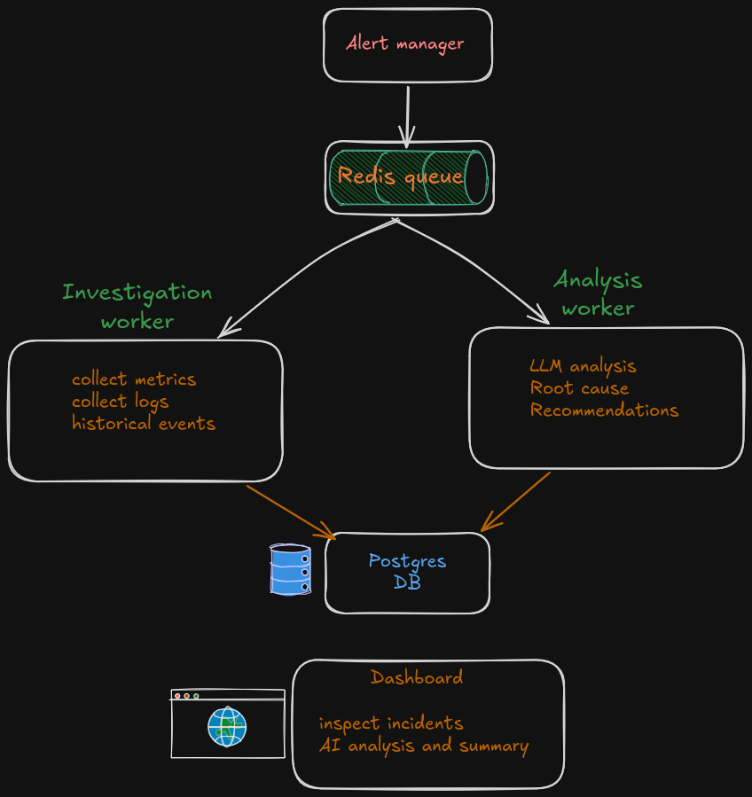
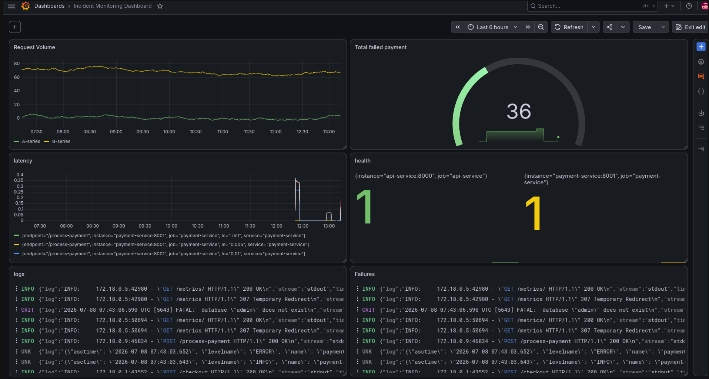
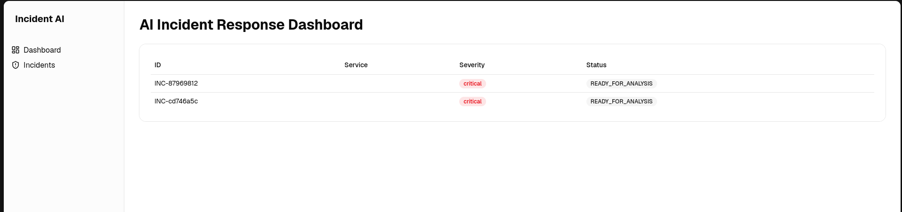
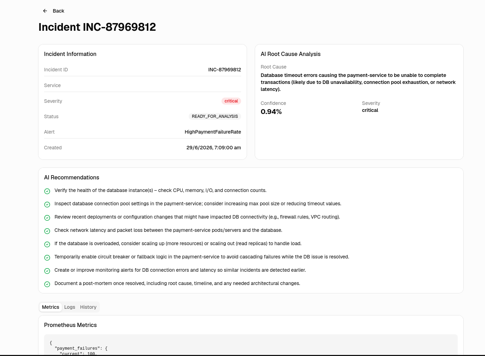

# AI Incident Response Agent

An end-to-end AI-powered incident investigation and root cause analysis system that automatically collects metrics, logs and historical events after an alert, performs LLM-based analysis, and presents recommendations for human approval.

This project simulates an enterprise production environment using Docker, Prometheus, Grafana, Loki, PostgreSQL, Redis and multiple FastAPI services.

---

## Features

- AI-powered Root Cause Analysis (RCA)
- Alert ingestion through Alertmanager webhook
- Automated incident investigation
- Metrics collection from Prometheus
- Log collection from Loki
- Historical incident lookup
- Redis-based asynchronous worker pipeline
- PostgreSQL persistence
- Human-in-the-loop approval workflow
- React dashboard
- Structured JSON logging
- Docker based deployment

---

# Architecture

```
                   Alertmanager
                         │
                         ▼
               Incident Webhook
                         │
                  Store Incident
                         │
                         ▼
                  Redis Queue
                         │
         ┌───────────────┴───────────────┐
         ▼                               ▼
 Investigation Worker             Analysis Worker
         │                               │
         │                               │
Collect Metrics                   LLM Analysis
Collect Logs                      Root Cause
Historical Events                 Recommendations
         │                               │
         └───────────────┬───────────────┘
                         ▼
                  PostgreSQL
                         │
                         ▼
                 React Dashboard
                         │
                         ▼
                 Human Approval
```
#SCREENSHOTS
[](assets/architecture_flow.png)
[](assets/grfana.png)
[](assets/dashboard2.png)
[](assets/dashboard.png)
---

# Project Structure

```
dummy-services/
    api-service/
    payment-service/
    docker-compose.yml

incident-agent/
    incident-service/
    investigation-worker/
    analysis-worker/

dashboard-ui/

dashboard-api/
```

---

# Workflow

1. AlertManager receives an alert from Prometheus.

2. AlertManager sends the alert to the Incident Service webhook.

3. Incident Service:

- creates an Incident
- stores it in PostgreSQL
- pushes a message into Redis

4. Investigation Worker consumes the queue.

It collects:

- Prometheus metrics
- Loki logs
- historical incidents

The collected evidence is stored inside the Investigation table.

5. Investigation Worker pushes the incident into the Analysis Queue.

6. Analysis Worker:

- summarizes evidence
- sends context to GPT-5
- receives root cause
- confidence
- recommendations

The result is stored in Investigation Results.

7. Dashboard displays

- Incident
- Investigation
- AI Analysis
- Recommendations

8. Human reviews the recommendation and resolves the incident.

---

# Tech Stack

Backend

- FastAPI
- SQLAlchemy
- PostgreSQL
- Redis

Monitoring

- Prometheus
- Alertmanager
- Grafana
- Loki
- Promtail

Frontend

- React
- TypeScript
- shadcn/ui

AI

- OpenAI GPT-5
- Structured prompting

Infrastructure

- Docker
- Docker Compose

---

# Database

Main tables

- incidents
- investigations
- investigation_results
- transactions
- service_events

---

# Running

First add llm api key in .env inside ai_agent dir \
add VITE_API_URL pointing to backend api.env.production and .env in ai_agent/dashboard-ui 

## Create Docker network

```bash
docker network create incident-net
```

---

## Start dummy services and initialze db

```bash
cd dummy-services

docker compose up -d

docker compose exec payment-service \
python migrations/init_db.py
```

---

## Start agent service and dashboard together

```bash
cd ai_agent

docker compose up -d

docker compose exec incident-service \
python migrations/init_db.py
```

---

# Useful URLs

Dashboard

```
http://localhost:8080 
```

Grafana

```
http://localhost:3000
```

Prometheus

```
http://localhost:9090
```

AlertManager

```
http://localhost:9093
```

Loki

```
http://localhost:3100
```

---

# Database

Connect

```bash
docker compose exec postgres \
psql -U admin -d incidentlab
```

Show tables

```sql
\dt
```

---

# Simulating Traffic

Generate normal traffic

```bash
for i in {1..20}; do
    curl -X POST http://localhost:8000/checkout
done
```

Simulate payment failures

```bash
curl -X POST http://localhost:8001/simulate/failure
```

---

# AI Analysis

The Analysis Worker performs:

- Evidence summarization
- Prompt construction
- Root cause analysis
- Confidence estimation
- Severity prediction
- Action recommendations

---

# Human in the Loop

AI recommendations are **never executed automatically**.

Every investigation requires human approval before incident resolution.

---

# Future Improvements

- Kubernetes deployment
- Authentication and RBAC
- WebSocket live updates
- Slack / Teams notifications
- Automatic remediation
- Multi-agent investigation
- Knowledge graph for incident correlation

---